# NOX Architecture Sitemap (자동 생성)

> 마지막 생성: 2026-06-02
>
> 재생성: `node scripts/generate-architecture-map.mjs`
>
> 인터랙티브 도면: `public/m/_arch/map.html` (또는 https://nox.ai.kr/m/_arch/map.html — 로그인 필요)

## 통계

- 모바일 페이지: **18**
- Next.js 페이지: **101**
- API endpoint: **286**
- 총 노드: 447, 총 간선: 671

## 모바일 페이지 이동 (`/m/*.html`)

범례: `-->` href · `-.->`  location.href

```mermaid
graph LR
  m_add_maid_fast_html["add-maid-fast.html"]:::mobile
  m_add_maid_search_html["add-maid-search.html"]:::mobile
  m_add_maid_html["add-maid.html"]:::mobile
  m_add_staff_html["add-staff.html"]:::mobile
  m_assign_session_html["assign-session.html"]:::mobile
  m_attendance_html["attendance.html"]:::mobile
  m_chat_create_html["chat-create.html"]:::mobile
  m_chat_room_html["chat-room.html"]:::mobile
  m_chat_html["chat.html"]:::mobile
  m_index_html["index.html"]:::mobile
  m_me_html["me.html"]:::mobile
  m_settle_html["settle.html"]:::mobile
  m_staff_list_html["staff-list.html"]:::mobile
  m_staff_rules_html["staff-rules.html"]:::mobile
  m_staff_html["staff.html"]:::mobile
  m_store_detail_html["store-detail.html"]:::mobile
  m_store_settings_html["store-settings.html"]:::mobile
  m_store_settlement_html["store-settlement.html"]:::mobile
  m_add_maid_fast_html --> m_index_html
  m_add_maid_fast_html -.-> m_index_html
  m_add_maid_fast_html -.-> m_index_html
  m_add_maid_search_html --> m_index_html
  m_add_maid_search_html --> m_index_html
  m_add_maid_search_html -.-> m_index_html
  m_add_maid_html --> m_index_html
  m_add_maid_html -.-> m_index_html
  m_add_staff_html --> m_staff_rules_html
  m_add_staff_html --> m_staff_list_html
  m_add_staff_html -.-> m_staff_rules_html
  m_add_staff_html -.-> m_staff_list_html
  m_assign_session_html --> m_index_html
  m_assign_session_html --> m_index_html
  m_assign_session_html -.-> m_index_html
  m_assign_session_html -.-> m_index_html
  m_attendance_html --> m_index_html
  m_attendance_html --> m_add_staff_html
  m_attendance_html --> m_index_html
  m_attendance_html --> m_staff_list_html
  m_attendance_html --> m_chat_html
  m_attendance_html --> m_settle_html
  m_attendance_html --> m_me_html
  m_chat_create_html --> m_chat_html
  m_chat_create_html --> m_chat_html
  m_chat_create_html -.-> m_chat_room_html
  m_chat_room_html --> m_chat_html
  m_chat_html --> m_index_html
  m_chat_html --> m_chat_create_html
  m_chat_html --> m_chat_room_html
  m_chat_html --> m_chat_create_html
  m_chat_html --> m_chat_room_html
  m_chat_html --> m_chat_room_html
  m_chat_html --> m_chat_room_html
  m_chat_html --> m_chat_room_html
  m_chat_html --> m_chat_room_html
  m_chat_html --> m_index_html
  m_chat_html --> m_staff_list_html
  m_chat_html --> m_chat_html
  m_chat_html --> m_settle_html
  m_chat_html --> m_me_html
  m_index_html --> m_chat_html
  m_index_html --> m_staff_list_html
  m_index_html --> m_chat_html
  m_index_html --> m_chat_room_html
  m_index_html --> m_chat_room_html
  m_index_html --> m_chat_room_html
  m_index_html --> m_chat_room_html
  m_index_html --> m_chat_html
  m_index_html --> m_staff_html
  m_index_html --> m_settle_html
  m_index_html --> m_store_detail_html
  m_index_html --> m_store_detail_html
  m_index_html --> m_store_detail_html
  m_index_html --> m_store_detail_html
  m_index_html --> m_store_detail_html
  m_index_html --> m_store_detail_html
  m_index_html --> m_store_detail_html
  m_index_html --> m_store_detail_html
  m_index_html --> m_store_detail_html
  m_index_html --> m_store_detail_html
  m_index_html --> m_store_detail_html
  m_index_html --> m_store_detail_html
  m_index_html --> m_store_detail_html
  m_index_html --> m_store_detail_html
  m_index_html --> m_staff_html
  m_index_html --> m_assign_session_html
  m_index_html --> m_assign_session_html
  m_index_html --> m_add_maid_fast_html
  m_index_html --> m_add_maid_fast_html
  m_index_html --> m_add_maid_fast_html
  m_index_html --> m_index_html
  m_index_html --> m_staff_list_html
  m_index_html --> m_chat_html
  m_index_html --> m_settle_html
  m_index_html --> m_me_html
  m_index_html -.-> m_chat_html
  m_index_html -.-> m_staff_list_html
  m_index_html -.-> m_chat_html
  m_index_html -.-> m_chat_room_html
  m_index_html -.-> m_chat_room_html
  m_index_html -.-> m_chat_room_html
  m_index_html -.-> m_chat_room_html
  m_index_html -.-> m_chat_html
  m_index_html -.-> m_staff_html
  m_index_html -.-> m_settle_html
  m_index_html -.-> m_store_detail_html
  m_index_html -.-> m_store_detail_html
  m_index_html -.-> m_store_detail_html
  m_index_html -.-> m_store_detail_html
  m_index_html -.-> m_store_detail_html
  m_index_html -.-> m_store_detail_html
  m_index_html -.-> m_store_detail_html
  m_index_html -.-> m_store_detail_html
  m_index_html -.-> m_store_detail_html
  m_index_html -.-> m_store_detail_html
  m_index_html -.-> m_store_detail_html
  m_index_html -.-> m_store_detail_html
  m_index_html -.-> m_store_detail_html
  m_index_html -.-> m_store_detail_html
  m_index_html -.-> m_staff_html
  m_index_html -.-> m_assign_session_html
  m_index_html -.-> m_assign_session_html
  m_me_html --> m_index_html
  m_me_html --> m_store_settings_html
  m_me_html --> m_index_html
  m_me_html --> m_staff_list_html
  m_me_html --> m_chat_html
  m_me_html --> m_settle_html
  m_me_html --> m_me_html
  m_me_html -.-> m_store_settings_html
  m_settle_html --> m_index_html
  m_settle_html --> m_store_settlement_html
  m_settle_html --> m_store_settlement_html
  m_settle_html --> m_store_settlement_html
  m_settle_html --> m_store_settlement_html
  m_settle_html --> m_store_settlement_html
  m_settle_html --> m_store_settlement_html
  m_settle_html --> m_staff_list_html
  m_settle_html --> m_staff_rules_html
  m_settle_html --> m_staff_rules_html
  m_settle_html --> m_staff_rules_html
  m_settle_html --> m_index_html
  m_settle_html --> m_staff_list_html
  m_settle_html --> m_chat_html
  m_settle_html --> m_settle_html
  m_settle_html --> m_me_html
  m_settle_html -.-> m_store_settlement_html
  m_settle_html -.-> m_store_settlement_html
  m_settle_html -.-> m_store_settlement_html
  m_settle_html -.-> m_store_settlement_html
  m_settle_html -.-> m_store_settlement_html
  m_settle_html -.-> m_store_settlement_html
  m_settle_html -.-> m_staff_rules_html
  m_settle_html -.-> m_staff_rules_html
  m_settle_html -.-> m_staff_rules_html
  m_staff_list_html --> m_index_html
  m_staff_list_html --> m_store_settings_html
  m_staff_list_html --> m_add_staff_html
  m_staff_list_html --> m_attendance_html
  m_staff_list_html --> m_staff_html
  m_staff_list_html --> m_staff_html
  m_staff_list_html --> m_staff_html
  m_staff_list_html --> m_staff_html
  m_staff_list_html --> m_staff_html
  m_staff_list_html --> m_staff_html
  m_staff_list_html --> m_staff_html
  m_staff_list_html --> m_staff_html
  m_staff_list_html --> m_staff_html
  m_staff_list_html --> m_staff_html
  m_staff_list_html --> m_staff_html
  m_staff_list_html --> m_staff_html
  m_staff_list_html --> m_index_html
  m_staff_list_html --> m_staff_list_html
  m_staff_list_html --> m_chat_html
  m_staff_list_html --> m_settle_html
  m_staff_list_html --> m_me_html
  m_staff_rules_html --> m_staff_html
  m_staff_rules_html --> m_staff_html
  m_staff_rules_html -.-> m_staff_html
  m_staff_html --> m_index_html
  m_staff_html --> m_add_maid_html
  m_staff_html --> m_staff_rules_html
  m_staff_html --> m_add_maid_html
  m_staff_html -.-> m_staff_rules_html
  m_staff_html -.-> m_add_maid_html
  m_store_detail_html --> m_index_html
  m_store_detail_html --> m_chat_room_html
  m_store_detail_html --> m_index_html
  m_store_detail_html --> m_staff_list_html
  m_store_detail_html --> m_chat_html
  m_store_detail_html --> m_settle_html
  m_store_detail_html --> m_me_html
  m_store_detail_html --> m_chat_room_html
  m_store_detail_html --> m_add_maid_fast_html
  m_store_detail_html --> m_staff_html
  m_store_detail_html --> m_settle_html
  m_store_detail_html -.-> m_staff_html
  m_store_detail_html -.-> m_settle_html
  m_store_settings_html --> m_me_html
  m_store_settings_html --> m_index_html
  m_store_settings_html --> m_staff_list_html
  m_store_settings_html --> m_chat_html
  m_store_settings_html --> m_settle_html
  m_store_settings_html --> m_me_html
  m_store_settlement_html --> m_settle_html
  m_store_settlement_html --> m_chat_room_html
  m_store_settlement_html --> m_index_html
  m_store_settlement_html --> m_staff_list_html
  m_store_settlement_html --> m_chat_html
  m_store_settlement_html --> m_settle_html
  m_store_settlement_html --> m_me_html
  m_store_settlement_html --> m_chat_room_html
  classDef mobile fill:#FED7AA,stroke:#F59E0B,color:#7C2D12
  classDef app fill:#BBF7D0,stroke:#22C55E,color:#14532D
```



## Next.js 페이지 (`app/**/page.tsx`)

범례: `-->` Link · `==>` redirect / router.push

```mermaid
graph LR
  m_add_maid_fast_html["add-maid-fast.html"]:::mobile
  m_add_maid_search_html["add-maid-search.html"]:::mobile
  m_add_maid_html["add-maid.html"]:::mobile
  m_add_staff_html["add-staff.html"]:::mobile
  m_assign_session_html["assign-session.html"]:::mobile
  m_attendance_html["attendance.html"]:::mobile
  m_chat_create_html["chat-create.html"]:::mobile
  m_chat_room_html["chat-room.html"]:::mobile
  m_chat_html["chat.html"]:::mobile
  m_index_html["index.html"]:::mobile
  m_me_html["me.html"]:::mobile
  m_settle_html["settle.html"]:::mobile
  m_staff_list_html["staff-list.html"]:::mobile
  m_staff_rules_html["staff-rules.html"]:::mobile
  m_staff_html["staff.html"]:::mobile
  m_store_detail_html["store-detail.html"]:::mobile
  m_store_settings_html["store-settings.html"]:::mobile
  m_store_settlement_html["store-settlement.html"]:::mobile
  p___protected__settlements["/(protected)/settlements"]:::app
  p___protected__settlements_summary["/(protected)/settlements/summary"]:::app
  p___protected__settlements__id_["/(protected)/settlements/[id]"]:::app
  p__admin_approvals["/admin/approvals"]:::app
  p__admin_deployments["/admin/deployments"]:::app
  p__admin_learn["/admin/learn"]:::app
  p__admin_location_corrections["/admin/location-corrections"]:::app
  p__admin_members_create["/admin/members/create"]:::app
  p__admin_members["/admin/members"]:::app
  p__admin["/admin"]:::app
  p__admin_reconcile_grants["/admin/reconcile-grants"]:::app
  p__attendance["/attendance"]:::app
  p__audit["/audit"]:::app
  p__audit_events["/audit-events"]:::app
  p__ble["/ble"]:::app
  p__cafe_admin["/cafe/admin"]:::app
  p__cafe_admin__store_uuid__inbox["/cafe/admin/[store_uuid]/inbox"]:::app
  p__cafe_manage_account["/cafe/manage/account"]:::app
  p__cafe_manage_credits["/cafe/manage/credits"]:::app
  p__cafe_manage_finance["/cafe/manage/finance"]:::app
  p__cafe_manage_inbox["/cafe/manage/inbox"]:::app
  p__cafe_manage_menu["/cafe/manage/menu"]:::app
  p__cafe_manage["/cafe/manage"]:::app
  p__cafe_manage_pos["/cafe/manage/pos"]:::app
  p__cafe_manage_store["/cafe/manage/store"]:::app
  p__cafe__store_uuid_["/cafe/[store_uuid]"]:::app
  p__chat["/chat"]:::app
  p__chat__chat_room_id_["/chat/[chat_room_id]"]:::app
  p__counter_monitor["/counter/monitor"]:::app
  p__counter["/counter"]:::app
  p__counter__room_id__bill["/counter/[room_id]/bill"]:::app
  p__counter__room_id__checkin["/counter/[room_id]/checkin"]:::app
  p__counter__room_id__checkout["/counter/[room_id]/checkout"]:::app
  p__counter__room_id_["/counter/[room_id]"]:::app
  p__counter__room_id__payment["/counter/[room_id]/payment"]:::app
  p__counter__room_id__pre_settlement["/counter/[room_id]/pre-settlement"]:::app
  p__credits["/credits"]:::app
  p__customers["/customers"]:::app
  p__customers__customer_id_["/customers/[customer_id]"]:::app
  p__customers__customer_id__receipt__snapshot_id_["/customers/[customer_id]/receipt/[snapshot_id]"]:::app
  p__finance_expenses["/finance/expenses"]:::app
  p__finance["/finance"]:::app
  p__finance_purchases["/finance/purchases"]:::app
  p__find_id["/find-id"]:::app
  p__help["/help"]:::app
  p__inventory["/inventory"]:::app
  p__login["/login"]:::app
  p__m_monitor["/m/monitor"]:::app
  p__m_monitor_store__store_uuid_["/m/monitor/store/[store_uuid]"]:::app
  p__manager_ledger["/manager/ledger"]:::app
  p__manager["/manager"]:::app
  p__manager_settlement["/manager/settlement"]:::app
  p__manager_settlement__hostess_id_["/manager/settlement/[hostess_id]"]:::app
  p__me_home["/me/home"]:::app
  p__me["/me"]:::app
  p__me_security["/me/security"]:::app
  p__me_sessions__session_id_["/me/sessions/[session_id]"]:::app
  p__me_settlements["/me/settlements"]:::app
  p__monitor["/monitor"]:::app
  p__operating_days["/operating-days"]:::app
  p__ops_attendance["/ops/attendance"]:::app
  p__ops_ble_analytics["/ops/ble-analytics"]:::app
  p__ops_errors["/ops/errors"]:::app
  p__ops_issues["/ops/issues"]:::app
  p__ops["/ops"]:::app
  p__ops_watchdog["/ops/watchdog"]:::app
  p__owner_accounts["/owner/accounts"]:::app
  p__owner_ble["/owner/ble"]:::app
  p__owner_labels["/owner/labels"]:::app
  p__owner["/owner"]:::app
  p__owner_settlement["/owner/settlement"]:::app
  p__["/"]:::app
  p__payouts_cross_store["/payouts/cross-store"]:::app
  p__payouts_hostesses["/payouts/hostesses"]:::app
  p__payouts_managers["/payouts/managers"]:::app
  p__payouts["/payouts"]:::app
  p__payouts_settlement_tree["/payouts/settlement-tree"]:::app
  p__receipt["/receipt"]:::app
  p__receipt__snapshot_id_["/receipt/[snapshot_id]"]:::app
  p__reconcile["/reconcile"]:::app
  p__reconcile_setup["/reconcile/setup"]:::app
  p__reconcile_staff["/reconcile/staff"]:::app
  p__reconcile__id_["/reconcile/[id]"]:::app
  p__reports_overview["/reports/overview"]:::app
  p__reports["/reports"]:::app
  p__reports_period["/reports/period"]:::app
  p__reset_password_confirm["/reset-password/confirm"]:::app
  p__reset_password["/reset-password"]:::app
  p__settlement_history["/settlement/history"]:::app
  p__settlement["/settlement"]:::app
  p__signup["/signup"]:::app
  p__staff["/staff"]:::app
  p__staff_board["/staff-board"]:::app
  p__super_admin_location_corrections["/super-admin/location-corrections"]:::app
  p__super_admin["/super-admin"]:::app
  p__super_admin_stores__store_uuid_["/super-admin/stores/[store_uuid]"]:::app
  p__super_admin_visualize_money["/super-admin/visualize/money"]:::app
  p__super_admin_visualize_network["/super-admin/visualize/network"]:::app
  p__super_admin_visualize["/super-admin/visualize"]:::app
  p__test_offline["/test-offline"]:::app
  p__transfer["/transfer"]:::app
  m_add_maid_fast_html --> m_index_html
  m_add_maid_fast_html -.-> m_index_html
  m_add_maid_fast_html -.-> m_index_html
  m_add_maid_search_html --> m_index_html
  m_add_maid_search_html --> m_index_html
  m_add_maid_search_html -.-> m_index_html
  m_add_maid_html --> m_index_html
  m_add_maid_html -.-> m_index_html
  m_add_staff_html --> m_staff_rules_html
  m_add_staff_html --> m_staff_list_html
  m_add_staff_html -.-> m_staff_rules_html
  m_add_staff_html -.-> m_staff_list_html
  m_assign_session_html --> m_index_html
  m_assign_session_html --> m_index_html
  m_assign_session_html -.-> m_index_html
  m_assign_session_html -.-> m_index_html
  m_attendance_html --> m_index_html
  m_attendance_html --> m_add_staff_html
  m_attendance_html --> m_index_html
  m_attendance_html --> m_staff_list_html
  m_attendance_html --> m_chat_html
  m_attendance_html --> m_settle_html
  m_attendance_html --> m_me_html
  m_chat_create_html --> m_chat_html
  m_chat_create_html --> m_chat_html
  m_chat_create_html -.-> m_chat_room_html
  m_chat_room_html --> m_chat_html
  m_chat_html --> m_index_html
  m_chat_html --> m_chat_create_html
  m_chat_html --> m_chat_room_html
  m_chat_html --> m_chat_create_html
  m_chat_html --> m_chat_room_html
  m_chat_html --> m_chat_room_html
  m_chat_html --> m_chat_room_html
  m_chat_html --> m_chat_room_html
  m_chat_html --> m_chat_room_html
  m_chat_html --> m_index_html
  m_chat_html --> m_staff_list_html
  m_chat_html --> m_chat_html
  m_chat_html --> m_settle_html
  m_chat_html --> m_me_html
  m_index_html --> m_chat_html
  m_index_html --> m_staff_list_html
  m_index_html --> m_chat_html
  m_index_html --> m_chat_room_html
  m_index_html --> m_chat_room_html
  m_index_html --> m_chat_room_html
  m_index_html --> m_chat_room_html
  m_index_html --> m_chat_html
  m_index_html --> m_staff_html
  m_index_html --> m_settle_html
  m_index_html --> m_store_detail_html
  m_index_html --> m_store_detail_html
  m_index_html --> m_store_detail_html
  m_index_html --> m_store_detail_html
  m_index_html --> m_store_detail_html
  m_index_html --> m_store_detail_html
  m_index_html --> m_store_detail_html
  m_index_html --> m_store_detail_html
  m_index_html --> m_store_detail_html
  m_index_html --> m_store_detail_html
  m_index_html --> m_store_detail_html
  m_index_html --> m_store_detail_html
  m_index_html --> m_store_detail_html
  m_index_html --> m_store_detail_html
  m_index_html --> m_staff_html
  m_index_html --> m_assign_session_html
  m_index_html --> m_assign_session_html
  m_index_html --> m_add_maid_fast_html
  m_index_html --> m_add_maid_fast_html
  m_index_html --> m_add_maid_fast_html
  m_index_html --> m_index_html
  m_index_html --> m_staff_list_html
  m_index_html --> m_chat_html
  m_index_html --> m_settle_html
  m_index_html --> m_me_html
  m_index_html -.-> m_chat_html
  m_index_html -.-> m_staff_list_html
  m_index_html -.-> m_chat_html
  m_index_html -.-> m_chat_room_html
  m_index_html -.-> m_chat_room_html
  m_index_html -.-> m_chat_room_html
  m_index_html -.-> m_chat_room_html
  m_index_html -.-> m_chat_html
  m_index_html -.-> m_staff_html
  m_index_html -.-> m_settle_html
  m_index_html -.-> m_store_detail_html
  m_index_html -.-> m_store_detail_html
  m_index_html -.-> m_store_detail_html
  m_index_html -.-> m_store_detail_html
  m_index_html -.-> m_store_detail_html
  m_index_html -.-> m_store_detail_html
  m_index_html -.-> m_store_detail_html
  m_index_html -.-> m_store_detail_html
  m_index_html -.-> m_store_detail_html
  m_index_html -.-> m_store_detail_html
  m_index_html -.-> m_store_detail_html
  m_index_html -.-> m_store_detail_html
  m_index_html -.-> m_store_detail_html
  m_index_html -.-> m_store_detail_html
  m_index_html -.-> m_staff_html
  m_index_html -.-> m_assign_session_html
  m_index_html -.-> m_assign_session_html
  m_me_html --> m_index_html
  m_me_html --> m_store_settings_html
  m_me_html --> m_index_html
  m_me_html --> m_staff_list_html
  m_me_html --> m_chat_html
  m_me_html --> m_settle_html
  m_me_html --> m_me_html
  m_me_html -.-> m_store_settings_html
  m_settle_html --> m_index_html
  m_settle_html --> m_store_settlement_html
  m_settle_html --> m_store_settlement_html
  m_settle_html --> m_store_settlement_html
  m_settle_html --> m_store_settlement_html
  m_settle_html --> m_store_settlement_html
  m_settle_html --> m_store_settlement_html
  m_settle_html --> m_staff_list_html
  m_settle_html --> m_staff_rules_html
  m_settle_html --> m_staff_rules_html
  m_settle_html --> m_staff_rules_html
  m_settle_html --> m_index_html
  m_settle_html --> m_staff_list_html
  m_settle_html --> m_chat_html
  m_settle_html --> m_settle_html
  m_settle_html --> m_me_html
  m_settle_html -.-> m_store_settlement_html
  m_settle_html -.-> m_store_settlement_html
  m_settle_html -.-> m_store_settlement_html
  m_settle_html -.-> m_store_settlement_html
  m_settle_html -.-> m_store_settlement_html
  m_settle_html -.-> m_store_settlement_html
  m_settle_html -.-> m_staff_rules_html
  m_settle_html -.-> m_staff_rules_html
  m_settle_html -.-> m_staff_rules_html
  m_staff_list_html --> m_index_html
  m_staff_list_html --> m_store_settings_html
  m_staff_list_html --> m_add_staff_html
  m_staff_list_html --> m_attendance_html
  m_staff_list_html --> m_staff_html
  m_staff_list_html --> m_staff_html
  m_staff_list_html --> m_staff_html
  m_staff_list_html --> m_staff_html
  m_staff_list_html --> m_staff_html
  m_staff_list_html --> m_staff_html
  m_staff_list_html --> m_staff_html
  m_staff_list_html --> m_staff_html
  m_staff_list_html --> m_staff_html
  m_staff_list_html --> m_staff_html
  m_staff_list_html --> m_staff_html
  m_staff_list_html --> m_staff_html
  m_staff_list_html --> m_index_html
  m_staff_list_html --> m_staff_list_html
  m_staff_list_html --> m_chat_html
  m_staff_list_html --> m_settle_html
  m_staff_list_html --> m_me_html
  m_staff_rules_html --> m_staff_html
  m_staff_rules_html --> m_staff_html
  m_staff_rules_html -.-> m_staff_html
  m_staff_html --> m_index_html
  m_staff_html --> m_add_maid_html
  m_staff_html --> m_staff_rules_html
  m_staff_html --> m_add_maid_html
  m_staff_html -.-> m_staff_rules_html
  m_staff_html -.-> m_add_maid_html
  m_store_detail_html --> m_index_html
  m_store_detail_html --> m_chat_room_html
  m_store_detail_html --> m_index_html
  m_store_detail_html --> m_staff_list_html
  m_store_detail_html --> m_chat_html
  m_store_detail_html --> m_settle_html
  m_store_detail_html --> m_me_html
  m_store_detail_html --> m_chat_room_html
  m_store_detail_html --> m_add_maid_fast_html
  m_store_detail_html --> m_staff_html
  m_store_detail_html --> m_settle_html
  m_store_detail_html -.-> m_staff_html
  m_store_detail_html -.-> m_settle_html
  m_store_settings_html --> m_me_html
  m_store_settings_html --> m_index_html
  m_store_settings_html --> m_staff_list_html
  m_store_settings_html --> m_chat_html
  m_store_settings_html --> m_settle_html
  m_store_settings_html --> m_me_html
  m_store_settlement_html --> m_settle_html
  m_store_settlement_html --> m_chat_room_html
  m_store_settlement_html --> m_index_html
  m_store_settlement_html --> m_staff_list_html
  m_store_settlement_html --> m_chat_html
  m_store_settlement_html --> m_settle_html
  m_store_settlement_html --> m_me_html
  m_store_settlement_html --> m_chat_room_html
  p___protected__settlements ==> p__login
  p___protected__settlements ==> p__
  p___protected__settlements_summary ==> p__login
  p___protected__settlements_summary ==> p__
  p___protected__settlements__id_ ==> p__login
  p___protected__settlements__id_ ==> p__
  p__admin_approvals ==> p__login
  p__admin_deployments ==> p__login
  p__admin_deployments ==> p__owner
  p__admin_learn ==> p__login
  p__admin_learn ==> p__owner
  p__admin_learn ==> p__owner
  p__admin_location_corrections --> p__owner
  p__admin_members_create --> p__counter
  p__admin_members_create ==> p__login
  p__admin ==> p__login
  p__admin ==> p__owner
  p__admin ==> p__audit
  p__admin_reconcile_grants ==> p__login
  p__admin_reconcile_grants ==> p__login
  p__admin_reconcile_grants ==> p__owner
  p__attendance ==> p__login
  p__attendance ==> p__counter
  p__audit ==> p__login
  p__audit_events ==> p__login
  p__audit_events ==> p__owner
  p__ble ==> p__login
  p__ble ==> p__counter
  p__cafe_admin__store_uuid__inbox --> p__cafe_admin
  p__cafe_manage_credits --> p__cafe_manage
  p__cafe_manage_finance --> p__cafe_manage
  p__cafe_manage_menu --> p__cafe_manage
  p__cafe_manage --> p__cafe_manage_credits
  p__cafe_manage --> p__cafe_manage_inbox
  p__cafe_manage --> p__cafe_manage_menu
  p__cafe_manage --> p__cafe_manage_finance
  p__cafe_manage --> p__chat
  p__cafe_manage --> p__cafe_manage_store
  p__cafe_manage --> p__cafe_manage_pos
  p__cafe_manage --> p__cafe_manage_credits
  p__cafe_manage --> p__cafe_manage_account
  p__cafe_manage ==> p__login
  p__cafe_manage_pos --> p__cafe_manage
  p__cafe_manage_store --> p__cafe_manage
  p__chat ==> p__login
  p__chat ==> p__counter
  p__counter ==> m_index_html
  p__counter__room_id__bill ==> p__counter
  p__counter__room_id__checkin ==> p__counter
  p__counter__room_id__checkin ==> p__counter
  p__counter__room_id__checkout ==> p__counter
  p__counter__room_id__checkout ==> p__counter
  p__credits ==> p__login
  p__customers ==> p__login
  p__customers ==> p__counter
  p__customers__customer_id_ ==> p__login
  p__customers__customer_id_ ==> p__customers
  p__customers__customer_id_ ==> p__customers
  p__finance_expenses ==> p__login
  p__finance_expenses ==> p__login
  p__finance_expenses ==> p__finance
  p__finance ==> p__login
  p__finance_purchases ==> p__login
  p__finance_purchases ==> p__login
  p__finance_purchases ==> p__finance
  p__find_id --> p__login
  p__find_id --> p__signup
  p__find_id --> p__login
  p__help ==> p__counter
  p__inventory ==> p__login
  p__login --> p__signup
  p__login --> p__find_id
  p__login --> p__reset_password
  p__m_monitor --> p__counter_monitor
  p__m_monitor_store__store_uuid_ --> p__counter_monitor
  p__manager_ledger ==> p__login
  p__manager ==> p__login
  p__manager ==> p__login
  p__manager ==> p__login
  p__manager ==> p__admin_members_create
  p__manager_settlement ==> p__login
  p__manager_settlement ==> p__manager
  p__manager_settlement__hostess_id_ ==> p__manager_settlement
  p__me_home ==> p__login
  p__me_home ==> p__chat
  p__me_home ==> p__me
  p__me_home ==> p__chat
  p__me ==> p__login
  p__me ==> p__counter
  p__me_security ==> p__login
  p__me_sessions__session_id_ ==> p__login
  p__me_sessions__session_id_ ==> p__me
  p__me_sessions__session_id_ ==> p__me
  p__me_settlements ==> p__login
  p__me_settlements ==> p__me
  p__monitor ==> p__counter_monitor
  p__monitor ==> p__counter_monitor
  p__monitor ==> p__counter_monitor
  p__operating_days ==> p__login
  p__operating_days ==> p__counter
  p__operating_days ==> p__owner_settlement
  p__ops_ble_analytics --> p__counter_monitor
  p__ops_errors ==> p__login
  p__ops_errors ==> p__counter
  p__ops_issues ==> p__login
  p__ops_issues ==> p__counter
  p__ops ==> p__login
  p__ops ==> p__owner
  p__ops_watchdog ==> p__login
  p__ops_watchdog ==> p__counter
  p__ops_watchdog ==> p__ops_errors
  p__ops_watchdog ==> p__ops_issues
  p__owner_accounts ==> p__login
  p__owner_accounts ==> p__owner
  p__owner_ble ==> p__login
  p__owner_ble ==> p__owner
  p__owner_labels ==> p__login
  p__owner_labels ==> p__owner
  p__owner ==> p__login
  p__owner ==> p__cafe_manage
  p__owner ==> p__login
  p__owner ==> p__cafe_manage
  p__owner ==> p__login
  p__owner ==> p__login
  p__owner ==> p__counter
  p__owner ==> p__counter
  p__owner_settlement ==> p__login
  p__owner_settlement ==> p__owner
  p__ ==> m_index_html
  p__payouts_cross_store ==> p__login
  p__payouts_cross_store ==> p__payouts
  p__payouts_cross_store ==> p__login
  p__payouts_cross_store ==> p__payouts
  p__payouts_hostesses ==> p__login
  p__payouts_hostesses ==> p__payouts
  p__payouts_managers ==> p__login
  p__payouts_managers ==> p__payouts
  p__payouts_managers ==> p__login
  p__payouts_managers ==> p__payouts
  p__payouts --> p__counter
  p__payouts ==> p__login
  p__payouts ==> p__
  p__payouts ==> p__login
  p__payouts ==> p__payouts_managers
  p__payouts ==> p__payouts_hostesses
  p__payouts ==> p__payouts_cross_store
  p__payouts_settlement_tree ==> p__counter
  p__payouts_settlement_tree ==> p__payouts
  p__receipt ==> p__counter
  p__reconcile ==> p__login
  p__reconcile ==> p__counter
  p__reconcile_setup ==> p__login
  p__reconcile_staff ==> p__login
  p__reconcile_staff ==> p__reconcile
  p__reconcile__id_ ==> p__login
  p__reconcile__id_ ==> p__reconcile
  p__reconcile__id_ ==> p__reconcile_setup
  p__reports_overview ==> p__login
  p__reports_overview ==> p__reports
  p__reports ==> p__login
  p__reports ==> p__counter
  p__reports ==> p__reports_period
  p__reports ==> p__audit
  p__reports_period ==> p__login
  p__reports_period ==> p__reports
  p__reset_password_confirm --> p__reset_password
  p__reset_password_confirm --> p__login
  p__reset_password_confirm ==> p__login
  p__reset_password --> p__login
  p__reset_password --> p__find_id
  p__reset_password --> p__login
  p__reset_password ==> p__login
  p__reset_password ==> p__login
  p__reset_password ==> p__login
  p__settlement_history ==> p__login
  p__settlement_history ==> p__settlement
  p__settlement ==> p__login
  p__signup --> p__login
  p__signup ==> p__login
  p__staff ==> p__counter
  p__staff_board ==> p__me_home
  p__staff_board ==> p__login
  p__staff_board ==> p__counter
  p__super_admin_location_corrections --> p__super_admin
  p__super_admin --> p__super_admin_location_corrections
  p__super_admin --> p__admin_members_create
  p__super_admin --> p__counter
  p__super_admin ==> p__login
  p__super_admin_stores__store_uuid_ --> p__super_admin
  p__super_admin_stores__store_uuid_ ==> p__login
  p__super_admin_visualize_money --> p__super_admin_visualize
  p__super_admin_visualize_money ==> p__login
  p__super_admin_visualize_money ==> p__login
  p__super_admin_visualize_network --> p__super_admin_visualize
  p__super_admin_visualize_network ==> p__login
  p__super_admin_visualize_network ==> p__login
  p__super_admin_visualize --> p__super_admin_visualize_money
  p__super_admin_visualize --> p__super_admin_visualize_network
  p__transfer ==> p__login
  p__transfer ==> p__counter
  classDef mobile fill:#FED7AA,stroke:#F59E0B,color:#7C2D12
  classDef app fill:#BBF7D0,stroke:#22C55E,color:#14532D
```

## 꼬인 로직 검출

### 🔴 끊어진 링크 (대상 페이지 없음)

- /m/monitor/store/[store_uuid] → /m/monitor (redirect, mobile not found)
- /monitor → /m/monitor (redirect, mobile not found)
- /(protected)/settlements/summary → /settlements (page not found)
- /(protected)/settlements/summary → /settlements/summary (page not found)
- /(protected)/settlements/[id] → /settlements (page not found)

### 🟡 고아 페이지 (어디서도 진입 없음)

- add-maid-search.html (public/m/add-maid-search.html)
- /(protected)/settlements (app/(protected)/settlements/page.tsx)
- /(protected)/settlements/summary (app/(protected)/settlements/summary/page.tsx)
- /(protected)/settlements/[id] (app/(protected)/settlements/[id]/page.tsx)
- /admin/approvals (app/admin/approvals/page.tsx)
- /admin/deployments (app/admin/deployments/page.tsx)
- /admin/learn (app/admin/learn/page.tsx)
- /admin/location-corrections (app/admin/location-corrections/page.tsx)
- /admin/members (app/admin/members/page.tsx)
- /admin (app/admin/page.tsx)
- /admin/reconcile-grants (app/admin/reconcile-grants/page.tsx)
- /attendance (app/attendance/page.tsx)
- /audit-events (app/audit-events/page.tsx)
- /ble (app/ble/page.tsx)
- /cafe/admin/[store_uuid]/inbox (app/cafe/admin/[store_uuid]/inbox/page.tsx)
- /cafe/[store_uuid] (app/cafe/[store_uuid]/page.tsx)
- /chat/[chat_room_id] (app/chat/[chat_room_id]/page.tsx)
- /counter/[room_id]/bill (app/counter/[room_id]/bill/page.tsx)
- /counter/[room_id]/checkin (app/counter/[room_id]/checkin/page.tsx)
- /counter/[room_id]/checkout (app/counter/[room_id]/checkout/page.tsx)
- /counter/[room_id] (app/counter/[room_id]/page.tsx)
- /counter/[room_id]/payment (app/counter/[room_id]/payment/page.tsx)
- /counter/[room_id]/pre-settlement (app/counter/[room_id]/pre-settlement/page.tsx)
- /credits (app/credits/page.tsx)
- /customers/[customer_id] (app/customers/[customer_id]/page.tsx)
- /customers/[customer_id]/receipt/[snapshot_id] (app/customers/[customer_id]/receipt/[snapshot_id]/page.tsx)
- /finance/expenses (app/finance/expenses/page.tsx)
- /finance/purchases (app/finance/purchases/page.tsx)
- /help (app/help/page.tsx)
- /inventory (app/inventory/page.tsx)
- /m/monitor (app/m/monitor/page.tsx)
- /m/monitor/store/[store_uuid] (app/m/monitor/store/[store_uuid]/page.tsx)
- /manager/ledger (app/manager/ledger/page.tsx)
- /manager/settlement/[hostess_id] (app/manager/settlement/[hostess_id]/page.tsx)
- /me/security (app/me/security/page.tsx)
- /me/sessions/[session_id] (app/me/sessions/[session_id]/page.tsx)
- /me/settlements (app/me/settlements/page.tsx)
- /monitor (app/monitor/page.tsx)
- /operating-days (app/operating-days/page.tsx)
- /ops/attendance (app/ops/attendance/page.tsx)
- /ops/ble-analytics (app/ops/ble-analytics/page.tsx)
- /ops (app/ops/page.tsx)
- /ops/watchdog (app/ops/watchdog/page.tsx)
- /owner/accounts (app/owner/accounts/page.tsx)
- /owner/ble (app/owner/ble/page.tsx)
- /owner/labels (app/owner/labels/page.tsx)
- /payouts/settlement-tree (app/payouts/settlement-tree/page.tsx)
- /receipt (app/receipt/page.tsx)
- /receipt/[snapshot_id] (app/receipt/[snapshot_id]/page.tsx)
- /reconcile/staff (app/reconcile/staff/page.tsx)
- /reconcile/[id] (app/reconcile/[id]/page.tsx)
- /reports/overview (app/reports/overview/page.tsx)
- /reset-password/confirm (app/reset-password/confirm/page.tsx)
- /settlement/history (app/settlement/history/page.tsx)
- /staff (app/staff/page.tsx)
- /staff-board (app/staff-board/page.tsx)
- /super-admin/stores/[store_uuid] (app/super-admin/stores/[store_uuid]/page.tsx)
- /test-offline (app/test-offline/page.tsx)
- /transfer (app/transfer/page.tsx)

### 🔵 호출 없는 API endpoint

> 페이지가 직접 부르지 않는 endpoint. 다른 endpoint 가 내부 호출하거나, 외부 cron / 스크립트가 부르거나, 미사용일 수 있음.

- /api/admin/members/invite (app/api/admin/members/invite/route.ts)
- /api/admin/preferences (app/api/admin/preferences/route.ts)
- /api/auth/devices/revoke (app/api/auth/devices/revoke/route.ts)
- /api/auth/devices (app/api/auth/devices/route.ts)
- /api/auth/mfa/verify (app/api/auth/mfa/verify/route.ts)
- /api/auth/realtime-token (app/api/auth/realtime-token/route.ts)
- /api/auth/refresh (app/api/auth/refresh/route.ts)
- /api/ble/corrections (app/api/ble/corrections/route.ts)
- /api/ble/feedback/kpi (app/api/ble/feedback/kpi/route.ts)
- /api/ble/feedback (app/api/ble/feedback/route.ts)
- /api/ble/gateways/[id]/regenerate-secret (app/api/ble/gateways/[id]/regenerate-secret/route.ts)
- /api/ble/gateways/[id] (app/api/ble/gateways/[id]/route.ts)
- /api/ble/ingest (app/api/ble/ingest/route.ts)
- /api/ble/tags/[id] (app/api/ble/tags/[id]/route.ts)
- /api/cafe/credits/[id]/pay (app/api/cafe/credits/[id]/pay/route.ts)
- /api/cafe/manage/bootstrap (app/api/cafe/manage/bootstrap/route.ts)
- /api/cafe/menu/[id]/detail (app/api/cafe/menu/[id]/detail/route.ts)
- /api/cafe/menu/[id]/options (app/api/cafe/menu/[id]/options/route.ts)
- /api/cafe/menu/[id]/options/[group_id] (app/api/cafe/menu/[id]/options/[group_id]/route.ts)
- /api/cafe/menu/[id]/recipes (app/api/cafe/menu/[id]/recipes/route.ts)
- /api/cafe/menu/[id] (app/api/cafe/menu/[id]/route.ts)
- /api/cafe/orders (app/api/cafe/orders/route.ts)
- /api/cafe/orders/[id] (app/api/cafe/orders/[id]/route.ts)
- /api/cafe/reviews (app/api/cafe/reviews/route.ts)
- /api/cafe/storefront/[store_uuid] (app/api/cafe/storefront/[store_uuid]/route.ts)
- /api/cafe/supplies/[id] (app/api/cafe/supplies/[id]/route.ts)
- /api/chat/messages (app/api/chat/messages/route.ts)
- /api/chat/rooms/[id]/close (app/api/chat/rooms/[id]/close/route.ts)
- /api/chat/rooms/[id]/leave (app/api/chat/rooms/[id]/leave/route.ts)
- /api/chat/rooms/[id]/participants (app/api/chat/rooms/[id]/participants/route.ts)
- /api/chat/rooms/[id]/pin (app/api/chat/rooms/[id]/pin/route.ts)
- /api/chat/rooms/[id]/read (app/api/chat/rooms/[id]/read/route.ts)
- /api/counter/bootstrap (app/api/counter/bootstrap/route.ts)
- /api/counter/monitor (app/api/counter/monitor/route.ts)
- /api/credits/[credit_id] (app/api/credits/[credit_id]/route.ts)
- /api/cron/audit-archive (app/api/cron/audit-archive/route.ts)
- /api/cron/ble-attendance-sync (app/api/cron/ble-attendance-sync/route.ts)
- /api/cron/ble-history-reaper (app/api/cron/ble-history-reaper/route.ts)
- /api/cron/ble-session-inference (app/api/cron/ble-session-inference/route.ts)
- /api/cron/ops-alerts-scan (app/api/cron/ops-alerts-scan/route.ts)
- /api/cron/paper-ledger-expire (app/api/cron/paper-ledger-expire/route.ts)
- /api/cron/settlement-tree-advance (app/api/cron/settlement-tree-advance/route.ts)
- /api/cron/system-errors-cleanup (app/api/cron/system-errors-cleanup/route.ts)
- /api/cron/watchdog (app/api/cron/watchdog/route.ts)
- /api/cross-store/approve (app/api/cross-store/approve/route.ts)
- /api/cross-store/payout/cancel (app/api/cross-store/payout/cancel/route.ts)
- /api/cross-store/records (app/api/cross-store/records/route.ts)
- /api/cross-store/settlement (app/api/cross-store/settlement/route.ts)
- /api/cross-store/work-record (app/api/cross-store/work-record/route.ts)
- /api/cross-store/[id] (app/api/cross-store/[id]/route.ts)
- … 외 109개

### ↻ 순환 참조

- index.html → chat.html → index.html
- chat.html → chat-create.html → chat.html
- chat.html → chat-create.html → chat-room.html → chat.html
- index.html → chat.html → staff-list.html → index.html
- index.html → chat.html → staff-list.html → store-settings.html → me.html → index.html
- store-settings.html → me.html → store-settings.html
- staff-list.html → store-settings.html → me.html → staff-list.html
- chat.html → staff-list.html → store-settings.html → me.html → chat.html
- index.html → chat.html → staff-list.html → store-settings.html → me.html → settle.html → index.html
- settle.html → store-settlement.html → settle.html
- index.html → chat.html → staff-list.html → store-settings.html → me.html → settle.html → store-settlement.html → index.html
- staff-list.html → store-settings.html → me.html → settle.html → store-settlement.html → staff-list.html
- chat.html → staff-list.html → store-settings.html → me.html → settle.html → store-settlement.html → chat.html
- me.html → settle.html → store-settlement.html → me.html
- staff-list.html → store-settings.html → me.html → settle.html → staff-list.html
- index.html → chat.html → staff-list.html → store-settings.html → me.html → settle.html → staff-rules.html → staff.html → index.html
- index.html → chat.html → staff-list.html → store-settings.html → me.html → settle.html → staff-rules.html → staff.html → add-maid.html → index.html
- staff-rules.html → staff.html → staff-rules.html
- chat.html → staff-list.html → store-settings.html → me.html → settle.html → chat.html
- settle.html → settle.html

